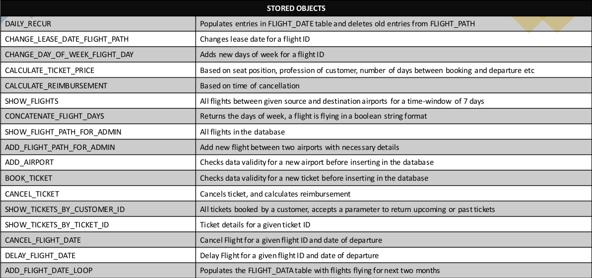

<div align="center">

  
  <h1>Altitude Airlines</h1>
  
  <p>
    A flight ticket booking and management application that allows users to search, book, and manage flight tickets efficiently. 
    It includes features for customers, admins, and super-admins to handle flight schedules, reservations, cancellations, and enterprise data management.
  </p>

   <p>
    <a href="presentation.pdf">Presentation</a>
  </p>
  
</div>

# :notebook_with_decorative_cover: Table of Contents

- [About the Project](#star2-about-the-project)
  - [Screenshots](#camera-screenshots)
  - [Tech Stack](#space_invader-tech-stack)
  - [Features](#dart-features)
  - [Schema](#bricks-schema)
  - [Stored Objects](#bricks-stored-objects)
  - [Environment Variables](#key-environment-variables)
- [Getting Started](#toolbox-getting-started)
  - [Prerequisites](#bangbang-prerequisites)
  - [Setup](#gear-setup)
- [Collaborators](#handshake-collaborators)

## :star2: About the Project

Altitude Airlines is a full-fledged flight booking and management system designed to provide a seamless experience for customers while ensuring efficient administration. It features dynamic ticket pricing, role-based access, and real-time schedule updates.

### :camera: Screenshots

<div align="center"> 
  </img> 
  </img> 
  </img> 
</div>

### :space_invader: Tech Stack

- **Client:** React.js, Material UI  
- **Server:** Node.js, Express.js  
- **Database:** MySQL  

### :dart: Features

#### Customer
- Search flights with flexible date options  
- Reserve seats with unique IDs and passenger details  
- Dynamic ticket pricing based on distance, seat preference, and booking time  
- View booked tickets categorized as Upcoming Journeys and Archive  
- Download tickets as dynamically generated PDFs  
- Cancel tickets with refund policies  
- Manage personal details from the user profile  

#### Admin
- View enterprise data, including flight routes and schedules  

#### Super-Admin
- Modify flight schedules, delay/cancel flights, extend aircraft leases  
- Manage enterprise data with extra privileges  

#### Additional Features
- Handles time zone differences  
- Data validation across frontend, backend, and database  
- Ensures error-free records with rigorous checks  
- Seats become available for rebooking after cancellation  

### :bricks: Schema

<div align="center">

</div>

### :bricks: Stored Objects

<div align="center">

</div>

### :key: Environment Variables

To run this project, you will need to add the following environment variables to your `.env` file:

`PORT`

`NODE_ENV`

`MYSQL_USER`

`MYSQL_HOST`

`MYSQL_PASSWORD`

`MYSQL_DATABASE`

`JWT_COOKIE_EXPIRES_IN`

`JWT_SECRET`

`JWT_EXPIRES_IN`


## :toolbox: Getting Started

### :bangbang: Prerequisites

This project requires `npm` as a package manager.

### :gear: Setup

Clone the project:

```bash
git clone https://github.com/Jabi-0935/Altitude_Airlines.git
```

Go to the project directory

```bash
  cd airline-booking-management-system
```

Install server dependencies

```bash
  npm install
```

Install client dependencies

```bash
  npm run install-client
```

Start the server

```bash
  npm run dev
```

Start the client

```bash
  cd client && npm start
```

<!-- Contact -->

## :handshake: Collaborators

- [S Md ISMAEEL JABIULLA](https://github.com/Jabi-0935)

